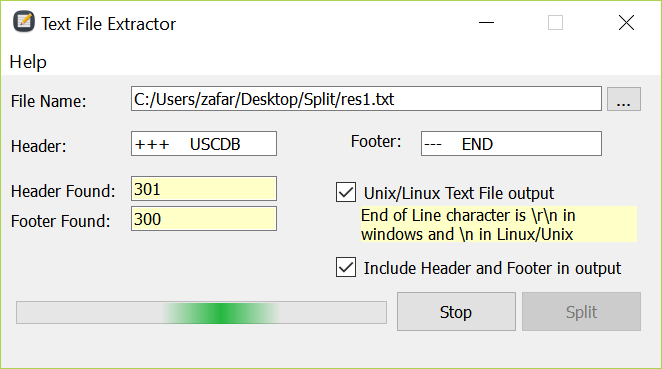

# TextFileExtractor v1.0
Extract a portion of a text file and save it as a separate file.

Select a Header Text and a Footer Text, and the main input file.
Program will search the input file for the header, if found, it makes a new file in the same location as the input file. 
It continues reading the source file, untill it reaches the Footer text.
If another header is found, a new file will be creaded.

# Binary Releases
[Download "TextFileExtractor v1.0.1" Windows Binary here.](https://github.com/rayanelectro/TextFileExtractor/releases/download/1.0.1/TextFileExtractor-v1.0.1-BIN.zip_)

# Compiled with QT 5.2
